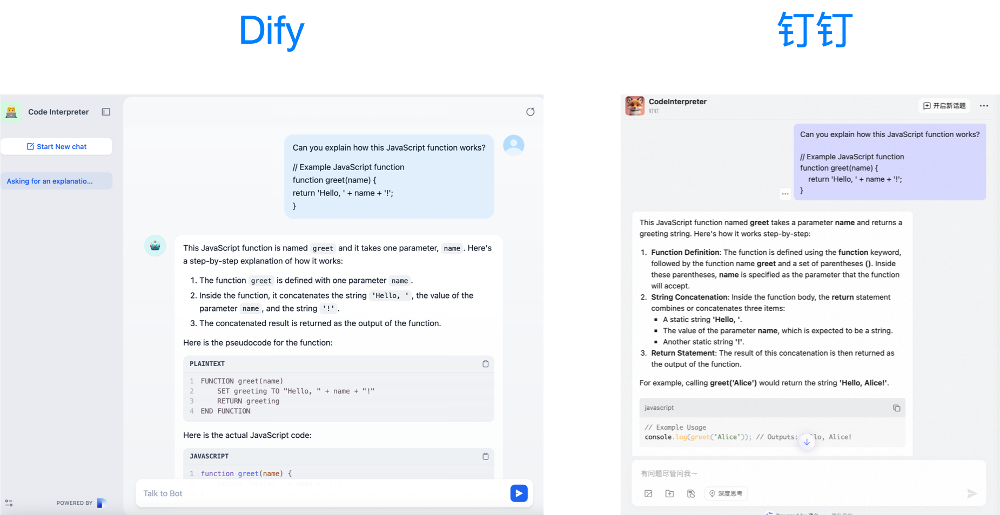

# 把 Dify 中的 Agent 接入到钉钉 AI 助理中

通过 Dify 实现一个钉钉 AI 助理，采用钉钉 AI 助理平台提供的 Stream 直通模式，不用公网服务器和域名即可部署。

5分钟集成一个 Dify Agent 到钉钉中。 

## 效果展示

将 Dify 中搭建的 Agent 接入到钉钉中：



## 环境变量配置

- DINGTALK_CLIENT_ID，钉钉 AI 助理的凭证，参考[钉钉 AI 助理直通模式开发教程 - Python](https://opensource.dingtalk.com/developerpedia/docs/explore/tutorials/assistant_ability/passthrough_mode/python)
- DINGTALK_CLIENT_SECRET，钉钉 AI 助理的凭证，参考[钉钉 AI 助理直通模式开发教程 - Python](https://opensource.dingtalk.com/developerpedia/docs/explore/tutorials/assistant_ability/passthrough_mode/python)
- DIFY_API_KEY，Dify Agent 发布后获得的 API Key，参考[Dify - Developing with APIs](https://docs.dify.ai/guides/application-publishing/developing-with-apis)
- DIFY_BASE_URL，选填，默认值：https://api.dify.ai/v1

## 运行

```python
python3 main.py
```

备注：本项目代码在 Python 3.13 测试通过。

## 参考资料

1. [钉钉 AI 助理直通模式开发教程 - Python](https://opensource.dingtalk.com/developerpedia/docs/explore/tutorials/assistant_ability/passthrough_mode/python)
2. [Dify - Developing with APIs](https://docs.dify.ai/guides/application-publishing/developing-with-apis)